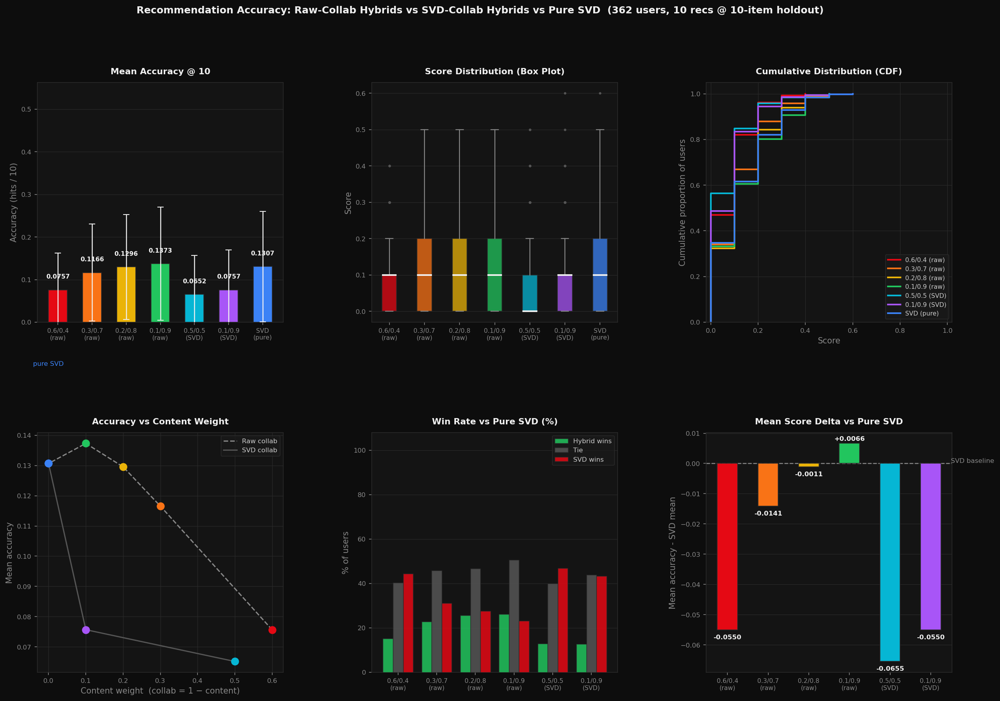

# NextWatch

A hybrid movie recommender system with a Streamlit interface.

NextWatch recommends movies from the ones you already like. It blends two signals:
what a movie is (its genres) and how people rate it (who liked it also liked what).
You search for movies and TV shows, keep a wishlist and a watched list with your own
ratings, and get recommendations computed from your highest-rated movies.

Team project made at Hanyang University (Seoul), May–June 2026.

## How the recommender works

For each seed movie, two similarity scores are computed against every other movie:

| Signal | Method |
|---|---|
| Content | TF-IDF on genres, cosine similarity |
| Collaborative | Item-item cosine similarity on the user–movie rating matrix |

Each score is scaled to [0, 1], then blended:

```
hybrid = 0.1 × content + 0.9 × collaborative
```

With several seed movies (the "For You" tab), the scores are averaged across seeds
before blending, and the seeds themselves are excluded from the results.

## Evaluation

`evaluate.py` compares several hybrid weightings against a pure SVD baseline
(TruncatedSVD, 50 latent factors).

Protocol, for each of the 362 users with at least 20 movies rated 4.0 or higher:

- the 10 highest-rated movies are used as seeds;
- the next 10 are held out;
- each method produces 10 recommendations;
- the score is the share of recommendations found in the held-out set.

| Method | Content / collaborative | Mean score |
|---|---|---|
| Hybrid, item-item collaborative | 0.6 / 0.4 | 0.0757 |
| Hybrid, item-item collaborative | 0.3 / 0.7 | 0.1166 |
| Hybrid, item-item collaborative | 0.2 / 0.8 | 0.1296 |
| **Hybrid, item-item collaborative** | **0.1 / 0.9** | **0.1373** |
| Hybrid, SVD latent collaborative | 0.5 / 0.5 | 0.0652 |
| Hybrid, SVD latent collaborative | 0.1 / 0.9 | 0.0757 |
| Pure SVD (baseline) | – | 0.1307 |

The best weighting (0.1 / 0.9) scores about 5% higher than pure SVD, and is the one
used in the app. The margin is small compared with the spread between users
(standard deviation around 0.13), so it should be read as "at least as good as SVD",
not as a large gain.



## Run it

```bash
pip install -r requirements.txt
```

The app reads posters, trailers and streaming providers from the TMDB API.
Create a free key at [themoviedb.org](https://www.themoviedb.org/settings/api), then:

```bash
cp .streamlit/secrets.toml.example .streamlit/secrets.toml
```

Put your key in `.streamlit/secrets.toml`, and start the app:

```bash
streamlit run app.py
```

To reproduce the evaluation table and the figure:

```bash
python evaluate.py
```

## Files

| File | Content |
|---|---|
| `app.py` | Streamlit app and recommender |
| `evaluate.py` | Offline evaluation of hybrid weightings against SVD |
| `movies.csv`, `ratings.csv` | MovieLens data |
| `recommendation_accuracy.png` | Figure produced by `evaluate.py` |

## Authors

- [Yesoo-HY](https://github.com/Yesoo-HY)
- [Ikseno](https://github.com/Ikseno)
- [Mehdy03055](https://github.com/Mehdy03055)

## Data and credits

- Ratings and movies come from the MovieLens `ml-latest-small` dataset
  (100,836 ratings, 9,742 movies, 610 users), provided by GroupLens for
  non-commercial use. F. Maxwell Harper and Joseph A. Konstan, *The MovieLens
  Datasets: History and Context*, ACM TiiS, 2015.
- This product uses the TMDB API but is not endorsed or certified by TMDB.
